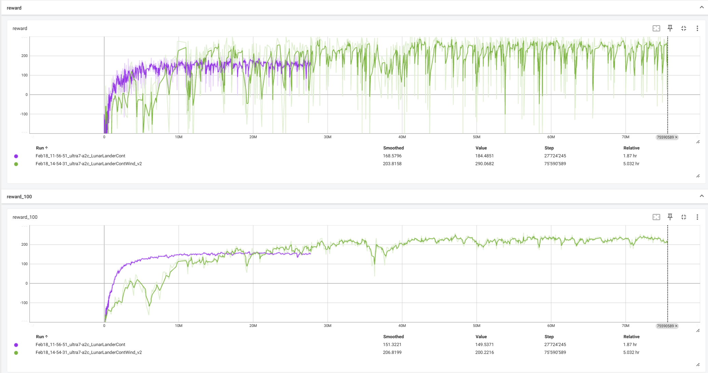

# Day 16 - A2C for Continuous problems (Advantage Actor Critic)

We now use the book Deep Reinforcment Learning - Hands-On, 3rd Edition, 2024, Lapan

see <https://leanpub.com/deepreinforcementlearninghands-on-thirdedition>
see <https://github.com/PacktPublishing/Deep-Reinforcement-Learning-Hands-On-Third-Edition>, Chapter 12

My own copy with some changes of the excercises code is here: <https://github.com/rogerbriggen/Deep-Reinforcement-Learning-Hands-On-Third-Edition>

## Excercise

Get to run [LunarLander](https://gymnasium.farama.org/environments/box2d/lunar_lander/) Continous with A2C

### Created files

- [Chapter16/01_train_a2c lunarlander.py](https://github.com/rogerbriggen/Deep-Reinforcement-Learning-Hands-On-Third-Edition/blob/main/Chapter16/01_train_a2c%20lunarlander.py) Copy of 01_train_a2c.py but adapted to LunarLander.
- [Chapter16/02_play lunarlander.py](https://github.com/rogerbriggen/Deep-Reinforcement-Learning-Hands-On-Third-Edition/blob/main/Chapter16/02_play%20lunarlander.py) Base version is 02_play.py but adapted for Lunar Lander.

## Environment

Python is a dependency hell... if just importing enviorment.yml does not work, check out Day 14 or the book instructions.

Use <https://github.com/rogerbriggen/Deep-Reinforcement-Learning-Hands-On-Third-Edition/tree/main/Chapter16> for the code.

The conda environment is named lapan.

### The environment can be created with conda

````shell
conda env create -f environment.yml
````

### The environment can be updated with conda

````shell
conda env update --file environment.yml --prune
````

### To save the updated environment

````shell
conda env export > environment.yml
````

### Install a specific version

````shell
pip install --force-reinstall -v "numpy==1.26.4"
````

### Additional Software

- No additinal software needed

### Environment variables

No environment variables needed

## Run

- Change to your local copy of the excercise
- Change to Chapter16
- Just run the different python files

## See results in tensorboard

````shell
# - Make sure you are in the correct conda env
# - Make sure you are in the Deep-Reinforcement-Learning-Hands-On-Third-Edition root directory
tensorboard --logdir=runs
````
Filter by LunarLanderCont

Open webbrowser at <http://localhost:6006/> (or check the output of the tensorboard start)

## Results

### Training without wind

Without wind, the A2C can solve LunarLander continuous very well, it can land it everytime very fast and get rewards around 280 and more.

Find the saved models here: <https://github.com/rogerbriggen/Deep-Reinforcement-Learning-Hands-On-Third-Edition/tree/main/saves/a2c-LunarLanderCont>

see [Training without wind, playing without wind](https://github.com/rogerbriggen/Deep-Reinforcement-Learning-Hands-On-Third-Edition/blob/main/vids/a2c-LunarLanderCont_best/rl-video-episode-0.mp4)

If we train without wind, but we enable the wind, we can still land the rocket but we will not land in between the 2 flags.

see [Training without wind, playing without wind](https://github.com/rogerbriggen/Deep-Reinforcement-Learning-Hands-On-Third-Edition/blob/main/vids/a2c-LunarLanderCont_wind_untrained/rl-video-episode-0.mp4)

### Training with wind

The training takes more time but the results are very good.

Find the saved models here: <https://github.com/rogerbriggen/Deep-Reinforcement-Learning-Hands-On-Third-Edition/tree/main/saves/a2c-LunarLanderContWind_v2>




#### No wind

In 156 steps we got 287.195 reward

[Video](https://github.com/rogerbriggen/Deep-Reinforcement-Learning-Hands-On-Third-Edition/blob/main/vids/a2c-LunarLanderContWind/training%20with%20wind%2C%20play%20no%20wind.mp4)

#### wind_power = 15.0, turbulence_power = 1.5

In 156 steps we got 272.365 reward

[Video](https://github.com/rogerbriggen/Deep-Reinforcement-Learning-Hands-On-Third-Edition/blob/main/vids/a2c-LunarLanderContWind/wind_power%20%3D%2015.0%2C%20turbulence_power%20%3D%201.5.mp4)

#### wind_power = 30.0, turbulence_power = 1.5

WARN: wind_power value is recommended to be between 0.0 and 20.0, (current value: 30.0)
In 344 steps we got 268.141 reward

[Video](https://github.com/rogerbriggen/Deep-Reinforcement-Learning-Hands-On-Third-Edition/blob/main/vids/a2c-LunarLanderContWind/wind_power%20%3D%2030.0%2C%20turbulence_power%20%3D%201.5.mp4)

#### wind_power = 45.0, turbulence_power = 1.5

WARN: wind_power value is recommended to be between 0.0 and 20.0, (current value: 45.0)
In 303 steps we got 212.611 reward

[Video](https://github.com/rogerbriggen/Deep-Reinforcement-Learning-Hands-On-Third-Edition/blob/main/vids/a2c-LunarLanderContWind/wind_power%20%3D%2045.0%2C%20turbulence_power%20%3D%201.5.mp4)

#### wind_power = 15.0, turbulence_power = 3.0

WARN: turbulence_power value is recommended to be between 0.0 and 2.0, (current value: 3.0)
In 173 steps we got 311.813 reward

[Video](https://github.com/rogerbriggen/Deep-Reinforcement-Learning-Hands-On-Third-Edition/blob/main/vids/a2c-LunarLanderContWind/wind_power%20%3D%2015.0%2C%20turbulence_power%20%3D%203.0.mp4)

#### wind_power = 30.0, turbulence_power = 3.0

WARN: wind_power value is recommended to be between 0.0 and 20.0, (current value: 30.0)
WARN: turbulence_power value is recommended to be between 0.0 and 2.0, (current value: 3.0)
In 252 steps we got 289.253 reward

[Video](https://github.com/rogerbriggen/Deep-Reinforcement-Learning-Hands-On-Third-Edition/blob/main/vids/a2c-LunarLanderContWind/wind_power%20%3D%2030.0%2C%20turbulence_power%20%3D%203.0.mp4)
